# University-Club-Membership

 This is a DBMS project featuring a University Club Information System which is considered as a legacy from the senior students to freshman students sharing with them their experiences. A student club needs a database as much as any other facility as the need of storing data is increasingly necessary.
 
  We carried out this project in 3 phases starting from collecting requirements and functionalities from our costumer all the way to implementing the project with MySQL and Windows forms. 

  ## Phase 1 ##
  In the first step, we have done requirement analysis, wrote requirements and functionalities and some of the possible queries. In the second step, we have written entity sets, attributes, primary keys, relationships and we have created E/R diagram. 

  ### Requirement Analysis ###

	
Developing this database really helped us gain real-world hands-on experience by using a full-fledged database management system and it was skill boosting and fun experience.

In our journey of gathering information and requirements for our database, after thinking about the functionalities of this database and consulting some of our friends who manage certain clubs in the university considering them as our customers we came up with following requirements and functions.

##### Requirements and Functionalities #####

This university club membership database stores and keeps track of the club's members, subunits, committees, events and workshops that are organized by the subunits each semester. The system will be used by several different users (with different authorities) like a normal member who can see the list of events and workshops or an authorized member for checking active members’ list and register new members or another authorized member for managing the budget. The system can also be used by a committee member to study the club's status, members, events, achievements and goals in order to make future plans and draw a map to achieve the club's short and long term goals.

1. The system stores each member's unique ID, Name, gender, faculty, department, year, birthdate, phone number, email, address, and status (active or passive member)

2.	The members of the club can join subunits which are like sub clubs each subunit is focused on specific field. Those subunits are managed by some member of the club and each one of them has unique identifier, name and a capacity of members that can join.

3.	 Subunits organize workshops in which they provide seminars, courses and all other educational activities that can be joined by any member of the club whether he/she is a member of the subunit or not. Each workshop has unique identifier, unique Name (even if the workshop is organized several times if will labeled as name + the year/month it took place), type which indicates what kind of workshop it is, starting date, ending date, time, tutor/specialist and a capacity of members that can join. 

4.	 Subunits also organize events; an event can be organized by one or more subunits also a subunit can organize one or more events which are attended by any member. An event has a unique identifier, Name, date and a time. 

5.	The club has committees like administrative board, economic board and so on. Which also have their unique identifier, unique name and a foundation date. Each committee consists of members in different positions. A member can only join one committee. 

6.	 We want to keep truck of the budget that is issued to each subunit on different times for different purposes. We store each budget's amount, type (type can be a descriptive word for the reason that budget was issued) and date.

##### Entity Sets: ######
-	MEMBER (from the 1st point)
-	SUBUNIT (from the 2nd point)
-	COMMITTEE (from the 5th point)
-	EVENT (from the 4th point)
-	WORKSHOP (from the 3rd point)
-	BUDGET (from the 6th point)

##### Atributes & Primary Keys: #####
-	MEMBER (MemID, Name, Sex, Faculty, Department, Year, Bdate, Phone, Email, Address, State) 
-	SUBUNIT (SubID, Name, Capacity) 
-	COMMITTEE (ComID, Name, StartYear)
-	EVENT (EvID, Name, date, Time)
-	WORKSHOP (WID, Name, Type, Tutor, Time, Capacity, StartDate, EndDate)
-	BUDGET (BudID, Amount, Type, IssuedDate)

##### Relationships: #####
- ***HAS A***, a 1:N relationship type between MEMBER and COMMITTEE. MEMBER participation is partial. COMMITTEE participation is total as users indicate in the requirements list. After consultation with users we decided to add Position attribute (which describes member’s position in the committee), start date and end date (to figure out which period of time a specific member held that position) to this relationship type.

- ***MANAGES***, a 1:1 relationship type between MEMBER and SUBUNIT. MEMBER participation is partial. SUBUNIT participation is total. We found it appropriate to add the StartDate and EndDate (indicates when a member started and finished their duty as the manager of the sub unit) attributes to this relationship type like we did it in MANAGES relationship between MEMBER and COMMITTEE.
- ***HAS A***, a M:N relationship type between MEMBER and SUBUNIT. MEMBER participation is partial. SUBUNIT participation is total. This indicates that a SUBUNIT can have several MEMBERs and a MEMBER can join several SUBUNITS as understood from the requirements. 

- ***ORGANIZES***, a 1:N relationship type between SUBUNIT and WORKSHOP. SUBUNIT participation is partial. WORKSHOP participation is total, after consulting the users we decided that a SUBUNIT can organize several Workshops that are related to their field of interest and  only one SUBUNIT is enough to organize a workshop.
- ***TAKES***, a M:N relationship type between MEMBER  and WORKSHOP. MEMBER and WORKSHOP participations are partial; this indicates that several members can take/participate in several workshops.

- ***ORGANIZES***, a M:N relationship type between SUBUNIT and EVENT. SUBUNIT participation is partial. EVENT participation is total, that indicates that several SUBUNITs might team up to organize an event and of course a single SUBUNIT can organize many events as required. 
- ***ATTENDS***, a M:N relationship type between MEMBER and EVENT. MEMBER and EVENT participations are both partial; several members can attend several events. 

- ***IssuedTo***, a 1:N relationship type between SUBUNIT and BUDGET, which is also the identifying relationship for the weak entity type “BUDGET”, considering a budget entity may only make sense and be worth storing if its issued to some SUBUNIT as the users pointed out.  SUBUNIT participation is partial. BUDGET participation is total.
- ***MANAGES***, a 1:N relationship type between MEMBERS and BUDGET, which is also the identifying relationship for the weak entity type BUDGET. It shows that there is a specific member who is responsible of the budget. MEMBER participation is partial. BUDGET participation is total.
  

#### E/R Diagram ####
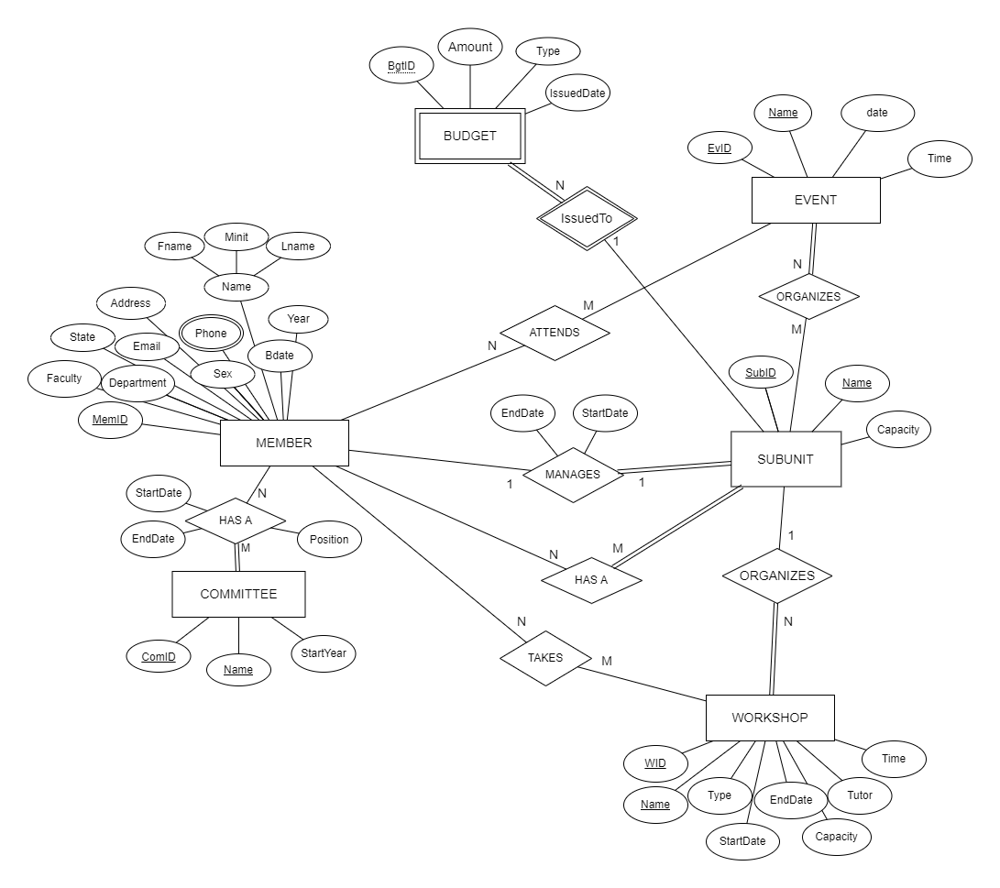

## Phase 2 ##
We got full point from phase 1 but, to maintain the simplicity and keep our database in BCNF we decided to make the following changes:

-	The HAS A relationship between MEMBER and COMMITTEE entity sets was changed to M:N relationship as a specific member with position can actually be member in several COMMITEEs.

-	The relationship ORGANIZES relationship between MEMBER and BUDGET entity sets was removed as we decided that it would make more sense if there is actually just one member that can be responsible for all budget transactions and that member’s position can actually be declared in the COMMITTEE table under the position attribute so this relationship would cause us redundancy (very unwanted thing) and there for was removed. 

We updated our diagram according to these changes. We have made relational schema according to the diagram. Then we applied normalize. We used MySQL to create the database. We created our tables and relations between tables with appropriate commands. We entered enough data into the database that we have created.

### The Relational Schema ###
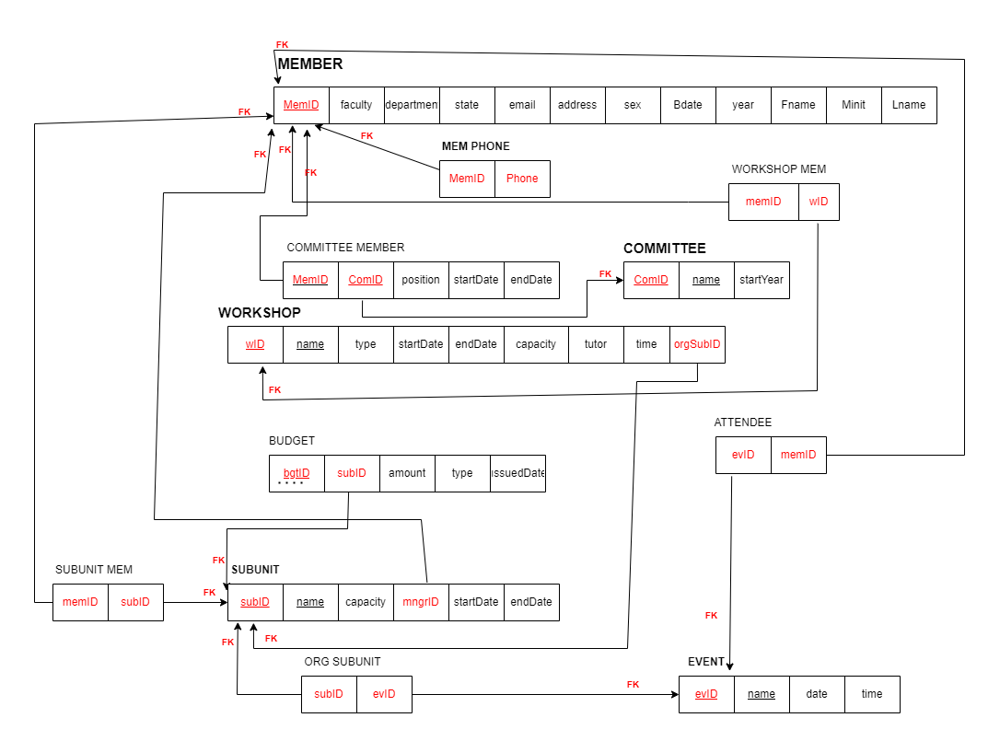

### SQL EER Diagram ###
This is the diagram after implementing it on MSSQL
 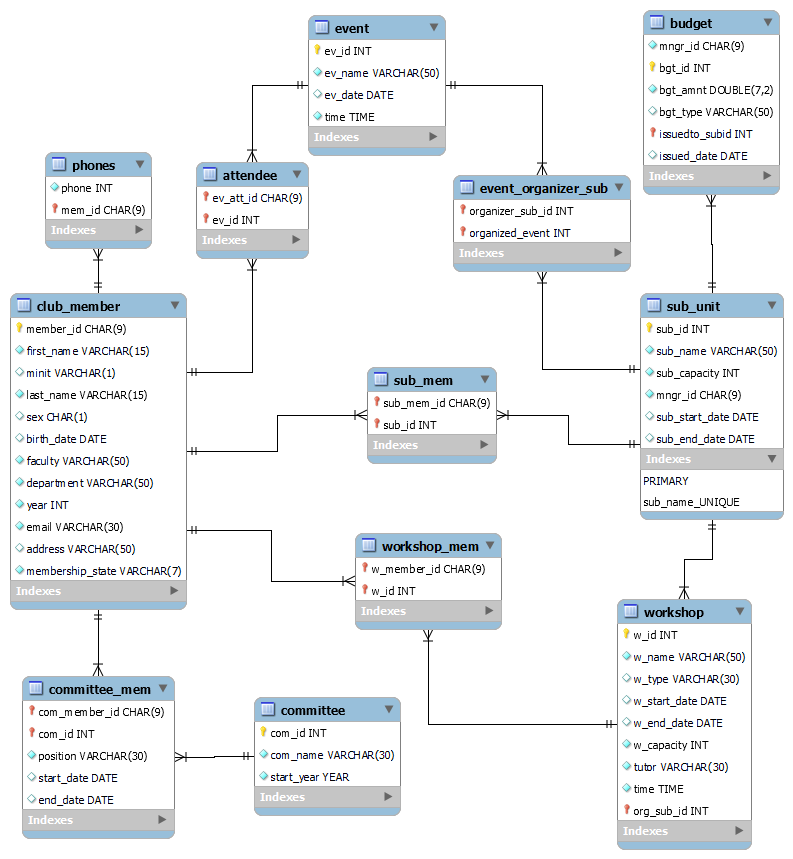

 ## Phase 3 ##
 In this phase we implemented the project using Windows Forms and C#.

 ### The UI of the Project ###

 Login: 
 By pressing the login button, we are directed to either the member page or the admin page according to the password and user name we entered. We can delete the username and password we entered by pressing the Clear button.

 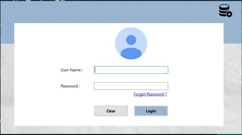

 If we enter wrong username or password, warning message pops up.

 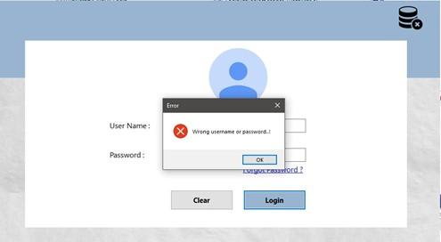

 ### Admin Login ###

 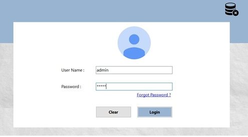

 When admin logs in, he/she sees a page like this:

 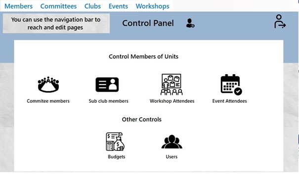

  ###### The navbar buttons of the page opened with the admin login ######

- When admin clicks on the Members button:
 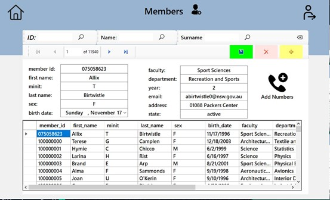 

Admin can search for users by entering id, name and surname:
 

 ###### After entering the necessary information; admin can add a new user by pressing the add new button and then the save data button, can delete the selected user by pressing the delete button and then the save data button, can change the user information and update the user information by pressing the save data button: ######
 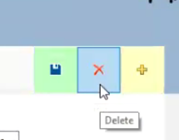 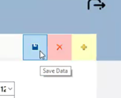 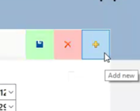

 

 For going to homepage and logging out these buttons can be used 
   

 By pressing the add numbers button, admin can add multiple numbers for users on the page that opens: 
 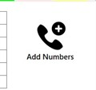

 Then this this page appears 
  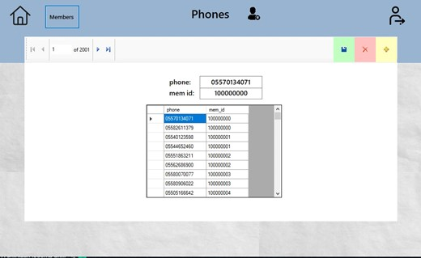

- When admin click on the Committees button: This page opens and admin can do the same things on the member page.
  
  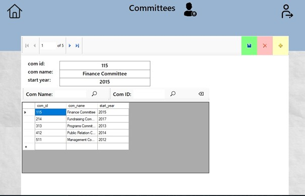
  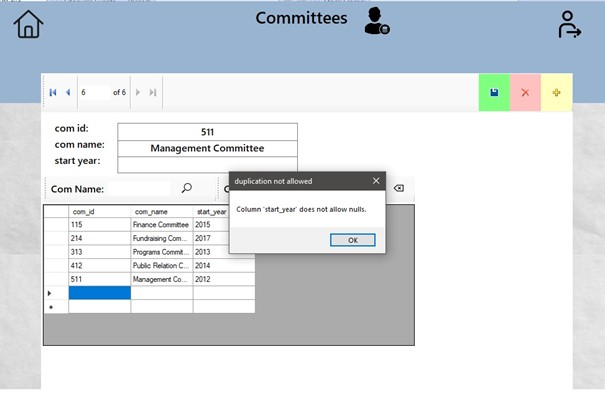

- When admin click on the Clubs button: This page opens and admin can do the same things on the member page.

 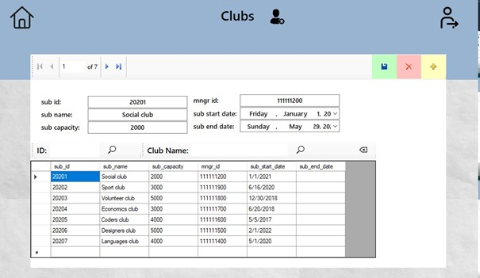

- When admin click on the Events button: This page opens and admin can do the same things on the member page.

 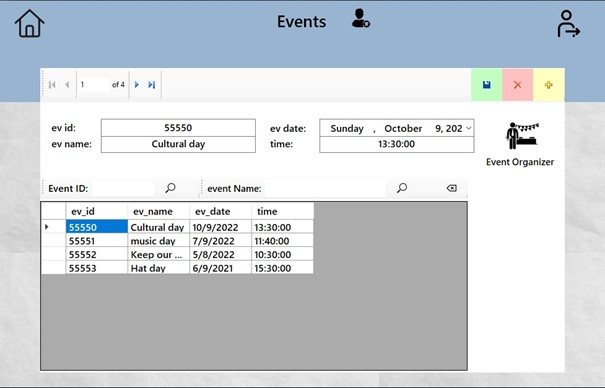

And admin can assign organizers to events with clicking the Event Organizer button

 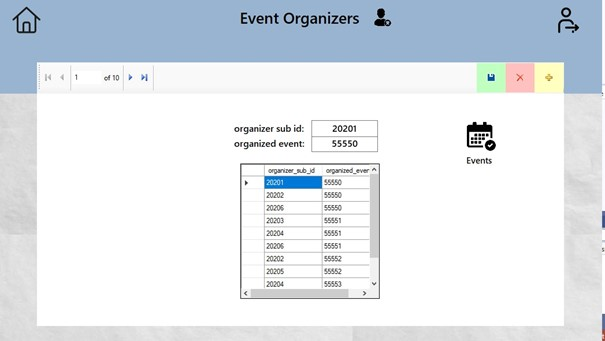

- When admin click on the Workshops button: This page opens and admin can do the same things on the member page.
  
  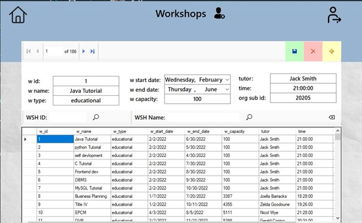

- When admin click on the Committee members button: This page opens and admin can add, members to the committee and delete or update them. 

 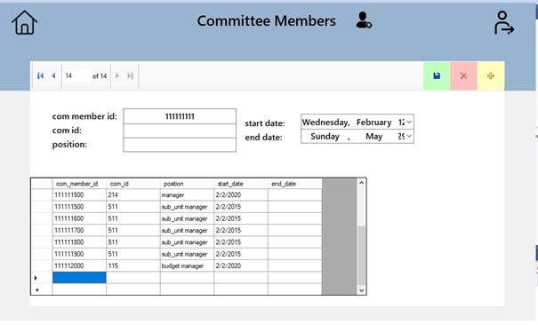

- When admin click on the Sub club members members button: This page opens and can add, members to the subclub and delete or update them.
  
  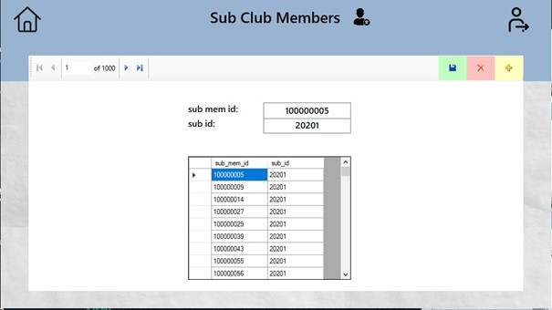
  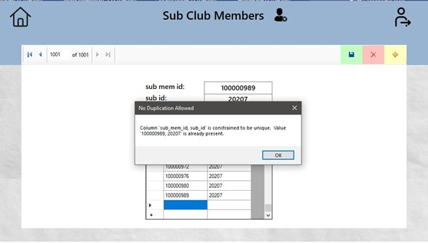

 - When admin click on the Workshop Attendees button: This page opens and  can add, members to a workshop and delete or update them.
 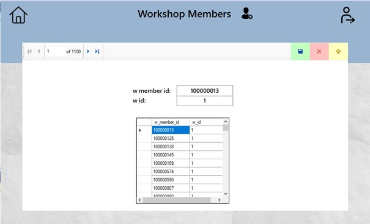

 - When admin click on the Event Attendees button: This page opens and can add, members to an event and delete or update them.
  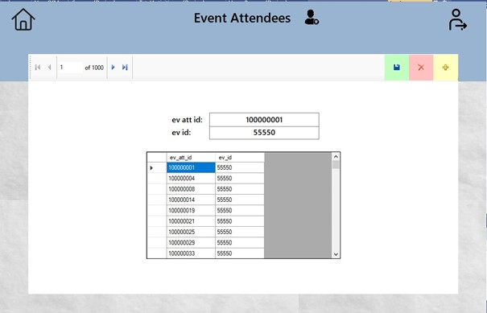

  - When admin click on the Budgets button: This page opens and can add, remove and update the budgets assigned to subunits
  

- When admin click on the Users button: This page opens and can add, remove and update the users login information.
  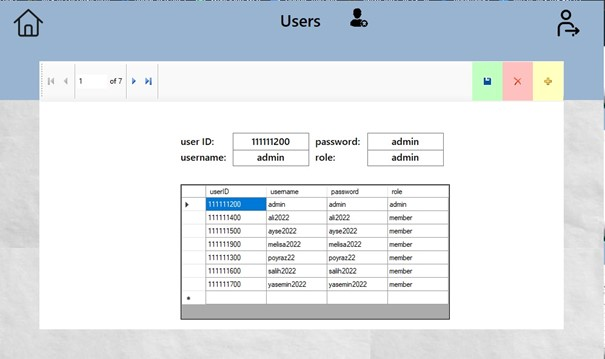

  ### Member Login ###
  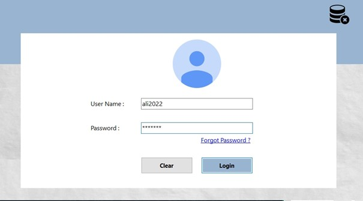

- After a member is logged in they  can see this page: 
  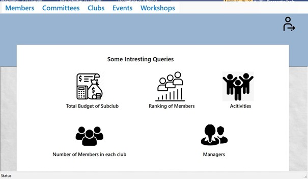

- When member clicks on the Members button: This page opens and member can see all members. (Members cannot see all the information as the admin sees it.) Members can search for users by entering id, name and surname:
  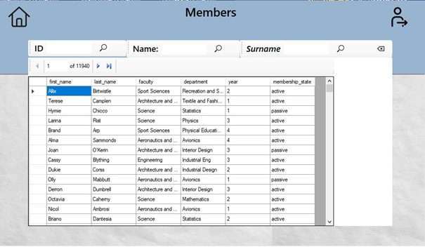

- When member clicks on the Committees button: This page opens and member can see all committees. (Members cannot see all the information as the admin sees it.) Members can search for committees by entering id, name.
  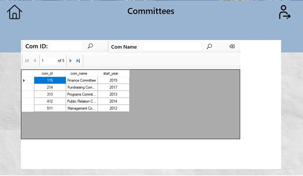

- When member clicks on the Clubs button: This page opens and member can see all clubs. (Members cannot see all the information as the admin sees it.) Members can search for clubs by entering id, name
  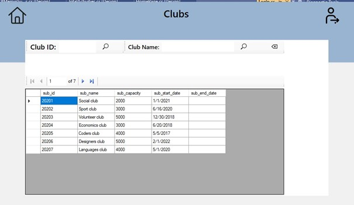

  
- When member clicks on the Events button: This page opens and member can see all events. (Members cannot see all the information as the admin sees it.) Members can search for events by entering id, name.
 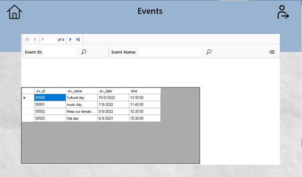

- When member clicks on the Workshops button: This page opens and member can see all workshops. (Members cannot see all the information as the admin sees it.) Members can search for workshops by entering id, name.
  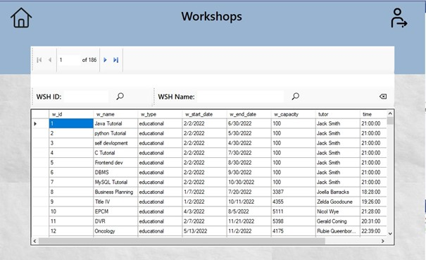

#### Some Query Pages ####
- When member clicks on the Total Budget of Subclub button: This page opens
  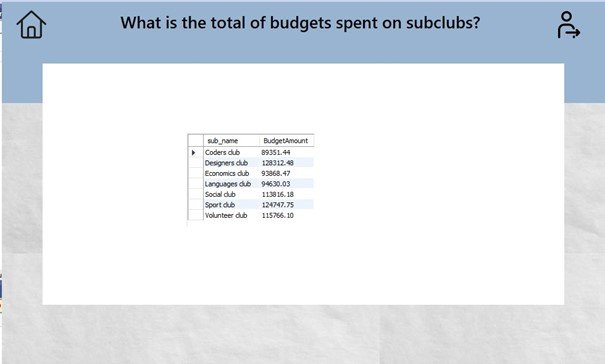

- When member clicks on the Activities button: This page opens
    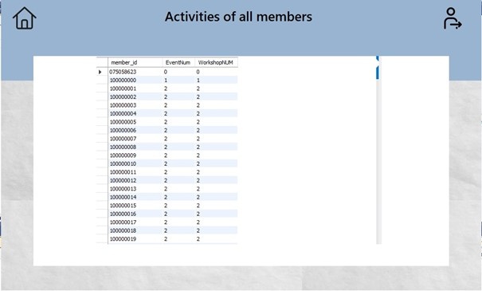

- When member clicks on the Number of Members in each club button: This page opens
    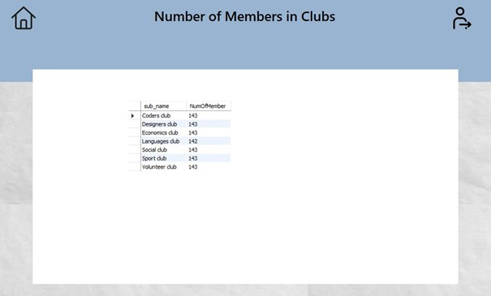

- When member clicks on the Ranking of Members button: This page opens
  
    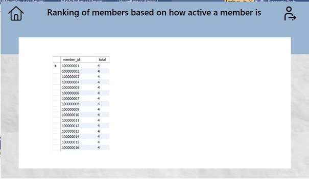

- When member clicks on the Managers button: This page opens
    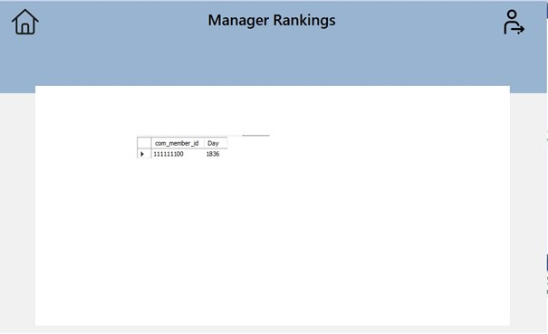

